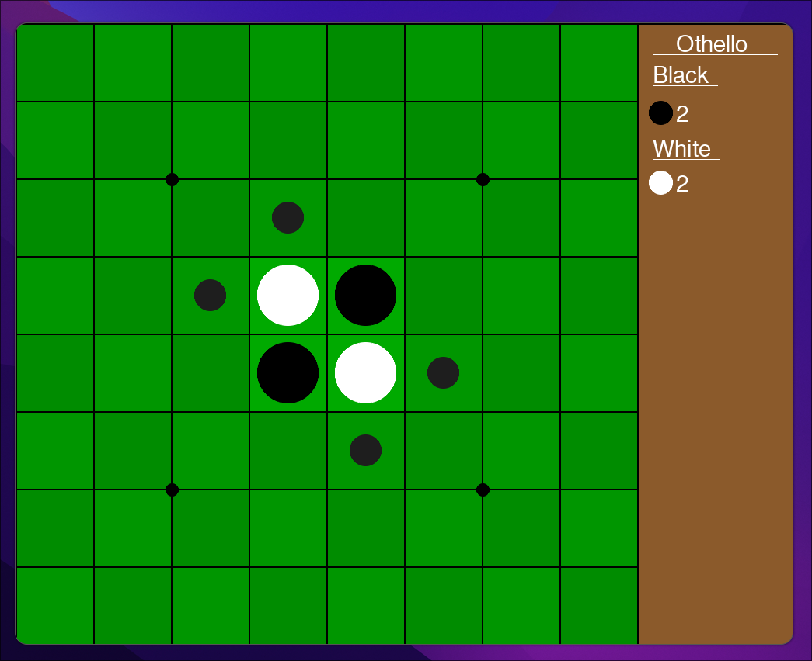
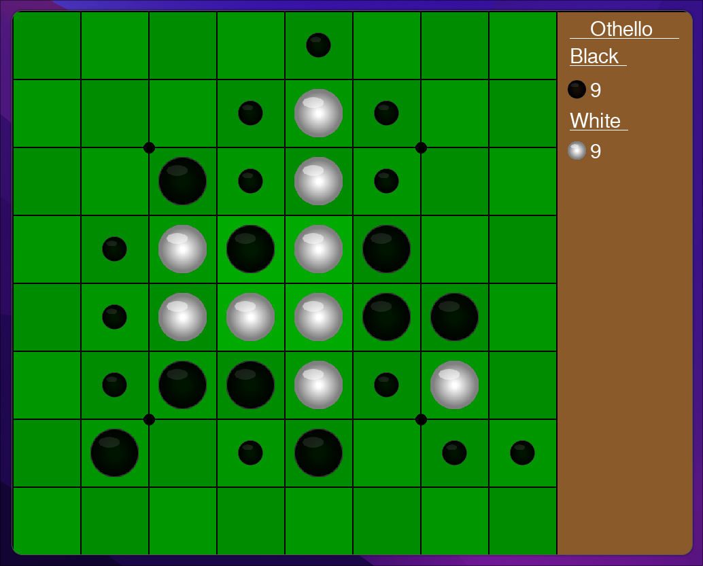
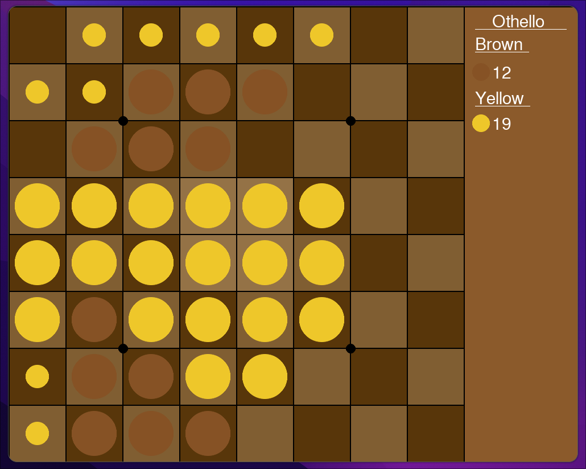
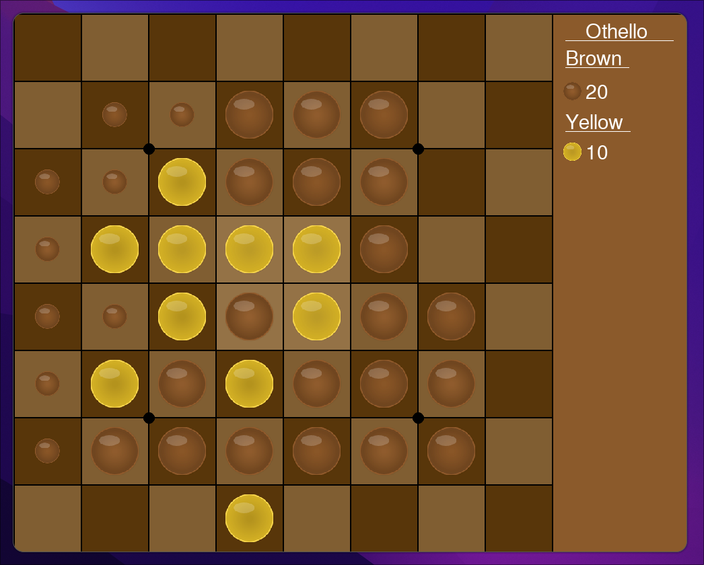

# Reversi (Othello)

This is a Python implementation of the classic board game Reversi (also known as Othello). The game is built using the Pygame library.

## Features

- Two-player mode
- Animated piece placement and flipping
- Display of legal moves
- Cheat mode to switch turns
- Reset functionality
- Color themes
- Config

## Requirements

- Python 3.x
- Pygame
- Toml

## Installation

1. Clone the repository:
	```sh
	git clone https://github.com/E3nviction/Reversi
	```
2. Navigate to the project directory:
	```sh
	cd Reversi
	```
3. Install the required dependencies:
	```sh
	pip install pygame
	```

## Usage

To start the game, run the following command:
```sh
python main.py
```

## Controls

- **Space**: Reset the game
- **L**: Toggle display of legal moves
- **C**: Toggle cheat mode
- **Left Alt**: Switch to player 1 (when cheat mode is enabled)
- **Right Alt**: Switch to player 2 (when cheat mode is enabled)

# Screenshots

Normal look:



Realistic look:



Alternate look:



Realistic Alternate look:



## License

This project is licensed under the MIT License.
